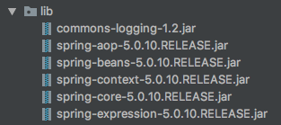
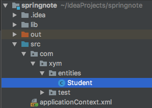

## 一、Spring环境搭建及第一个程序
### 搭建Spring环境
1. 在IDEA中新建普通java项目，导入jar包(5+1)<br>

2. 新建applicationContext.xml配置文件
3. 开发spring入门程序(IOC)
目录结构<br>

*applicationContext.xml*
```xml
<?xml version="1.0" encoding="UTF-8"?>
<beans xmlns="http://www.springframework.org/schema/beans"
       xmlns:xsi="http://www.w3.org/2001/XMLSchema-instance"
       xsi:schemaLocation="http://www.springframework.org/schema/beans http://www.springframework.org/schema/beans/spring-beans.xsd">

    <!--该文件产生的所有对象，被放入spring ioc 容器-->
    <!--id:唯一标识符 class：指定类型-->
    <bean id="student" class="com.xym.entities.Student">
        <property name="stuNo" value="1"/>
        <property name="stuName" value="zs"/>
        <property name="stuAge" value="23" />
    </bean>
</beans>
```
*student.java*
```java
package com.xym.entities;

public class Student {
    private int stuNo;
    private String stuName;
    private int stuAge;
    // get set toString
}
```
*StudentTest.java*
```java
@Test
public void firstSpring(){
        ApplicationContext context = new ClassPathXmlApplicationContext("applicationContext.xml");
        Student student = (Student) context.getBean("student");
        System.out.println(student);
    }
```