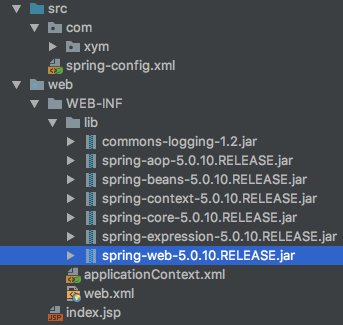

## 九、Spring开发WEB项目
Web项目如何初始化SpirngIOC容器：<br>
当服务启动时(tomcat)，通过监听器将SpringIOC容器初始化一次，该监听器spring-web.jar已提供<br>
用Spring开发Web项目需要7个jar包:spring(java项目6个)+spring-web.jar<br>
web项目启动时会自动加载web.xml，因此需要在web.xml中加载监听器(IOC容器初始化)<br>
初始化IOC容器(applicationContext.xml)
- 通过context-param告诉监听器此容器的位置
- 默认约定的位置并使用约定文件名/WEB-INF/applicationContext.xml

*目录结构*<br>


*web.xml*
```xml
<?xml version="1.0" encoding="UTF-8"?>
<web-app xmlns="http://xmlns.jcp.org/xml/ns/javaee"
         xmlns:xsi="http://www.w3.org/2001/XMLSchema-instance"
         xsi:schemaLocation="http://xmlns.jcp.org/xml/ns/javaee http://xmlns.jcp.org/xml/ns/javaee/web-app_4_0.xsd"
         version="4.0">
    <context-param>
        <!--告诉监听器IOC容器配置文件的位置-->
        <!--监听器的父类ContextLoader中有一个属性contextConfigLocation,该属性保存着容器配置文件的位置-->
        <param-name>contextConfigLocation</param-name>
        <!--<param-value>WEB-INF/applicationContext.xml</param-value>-->
        <param-value>classpath:spring-config.xml</param-value>
    </context-param>

    <listener>
        <!--配置spring-web.jar提供的监听器，此监听器可以在服务器启动时初始化IOC容器-->
        <listener-class>org.springframework.web.context.ContextLoaderListener</listener-class>
    </listener>
</web-app>
```