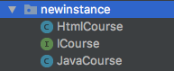

## 二、解耦合发展史，控制反转，依赖注入
### new方式创建对象
包结构

*ICourse.java*
```java
package com.xym.newinstance;

public interface ICourse {
    void learn();
}
```
*htmlCourse.java*
```java
public class HtmlCourse implements ICourse {
    @Override
    public void learn() {
        System.out.println("学习html...");
    }
}
```
*JavaCourse.java*
```java
public class JavaCourse implements ICourse {
    @Override
    public void learn() {
        System.out.println("学习java...");
    }
}
```
*Student.java*
```java
// ...
    public void learnJava(){
        JavaCourse javaCourse = new JavaCourse();
        javaCourse.learn();
    }

    public void learnHtml(){
        HtmlCourse htmlCourse = new HtmlCourse();
        htmlCourse.learn();
    }
```
*StudentTest.java*
```java
    @Test
    public void learnCourse(){
        Student student = new Student();
        student.learnHtml();
        student.learnJava();
    }
```
**创建对象new非常零散，造成后期维护较为麻烦**
### 通过简单工厂创建对象
*CourseFactory.java*
```java
package com.xym.factory;

//课程工厂
public class CourseFactory {
    //根据名字攻取课程
    public static ICourse getCourse(String name) {
        if (name.equals("java")) {
            return new JavaCourse();
        }else {
            return new HtmlCourse();
        }
    }
}
```
*Student.java*
```java
    //...
    //学习任何课程
    public void learn(String courseName) {
        //根据课程名称获取相应课程
        ICourse course = CourseFactory.getCourse(courseName);
        course.learn();
    }
```
*StudentTest.java*
```java
    @Test
    public void learnCourseWithFactory(){
        Student student = new Student();
        student.learn("java");
        student.learn("html");
    }
```
**通过简单工厂，可以将创建课程new集中起来操作，方便后期维护**
### SpringIOC方式(超级工厂)
**IOC: 控制反转，反转的是攻取对象的方式**
`Student student = new Student //自己通过new产生对象`
`context.getBean("student") //直接从springioc容器中获取`
*为了更清晰的理解IOC，IOC在一次大会上更名为DI(依赖注入)*
IOC(控制反转)也可以称之为DI(依赖注入)
- 控制反转：将创建对象、属性值的方式进行翻转，从new\setXXX()翻转为了从SpringIOC容器getBean()
- 依赖注入：将属性值 注入给属性，将属性注入给bean，将bean注入给IOC容器

**总结：IOC/DI，无论要什么对象，都可以直接去SpringIOC容器中获取，不需要自己操作**
使用IOC的方式分为两步：1.先给SpringIOC中存放对象并赋值 2.从容器中拿
*applicationContext.xml*
```xml
    <bean id="javaCourse" class="com.xym.newinstance.JavaCourse"/>
    <bean id="htmlCourse" class="com.xym.newinstance.HtmlCourse"/>
```
*Student.java*
```java
    public void learnWithIoC(String beanID) {
        ApplicationContext context = new ClassPathXmlApplicationContext("applicationContext.xml");
        //从SpringIOC提供的超级工厂中获取课程
        ICourse course = (ICourse) context.getBean(beanID);
        course.learn();
    }
```
*StudentTest.java*
```java
    @Test
    public void learnCourseWithIoC(){
        Student student = new Student();
        student.learnWithIoC("javaCourse");
        student.learnWithIoC("htmlCourse");
    }
```
