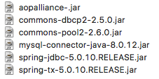

## 五、使用注解实现声明式事务
目标：通过事务使用以下方法要么全成功，要么全失败
```java
public void addStudent(){
    //增加班级
    //增加学生
    //CRUD
}
```
1. 导入jar包


2. 配置

*applicationContext.xml*
```xml
...
<!--配置数据库相关信息-->
    <bean id="dateSource" class="org.apache.commons.dbcp2.BasicDataSource">
        <property name="driverClassName" value="com.mysql.jdbc.Driver"/>
        <property name="url" value="jdbc:mysql://localhost:3306/xym?serverTimezone=Asia/Shanghai"/>
        <property name="username" value="root"/>
        <property name="password" value="root"/>
    </bean>
    <!--配置事务管理器transactionManager-->
    <bean id="transactionManager" class="org.springframework.jdbc.datasource.DataSourceTransactionManager">
        <property name="dataSource" ref="dateSource" />
    </bean>
    <!--增加对事务的支持-->
    <tx:annotation-driven transaction-manager="transactionManager"/>
```
3. 使用

将需要成为事务的方法前添加注解
`@Transactional(readOnly = false, propagation = Propagation.REQUIRED)`