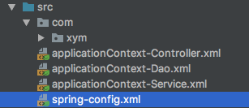
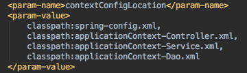
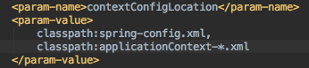
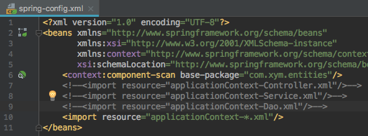

## 十、拆分Sping配置文件
普通JAVA项目可自定义多个applicationContext.xml，具体要哪个就new哪个 
Web项目：根据什么拆分？ 
 
- 三层结构拆分
  - UI(html/css/jsp、Servlet)：applicationController.xml
  - Service：applicationService.xml
  - Dao：applicationDao.xml
  - 公共、数据库：applicationDB.xml
- 功能结构拆分
  - 学生相关配置：applicationContextStudent.xml
  - 班级相关配置：applicationContextClass.xml
- 合并:将多个配置文件加载

1. 分别将各个配置文件用逗号分隔写入web.xml文件 
 
2. 使用通配符一次加载多个文件(推荐使用) 
 
3. 只在web.xml文件中加载主配置文件，在主配置文件中引入其它配置文件 
