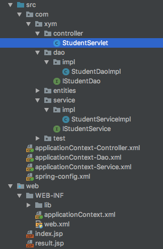

## 十一、Spring整合WEB项目
**启动时**：Spring会给Servlet的service属性通过DI注入，并纳入IOC容器<br>
**请求Servlet时**：请求的是tomcat服务器，这个Servlet由tomcat生成，此时的Servlet的service属于并未赋值<br>
两个Servlet分别为tomcat服务器与SpringIOC生成，放在各自的容器内<br>
请求tomcat生成的servlet需要通过init()将ioc中的service引入
*目录结构*<br>
<br>
*StudentDaoImpl.java*
```java
public class StudentDaoImpl implements IStudentDao {
    @Override
    public String queryStudentById() {
        //模拟通过JDBC查询数据
        System.out.println("1,zs,23");
        return "zs";
    }
}
```
*StudentServiceImpl*
```java
public class StudentServiceImpl implements IStudentService {
//    IStudentDao studentDao = new StudentDaoImpl();
    IStudentDao studentDao;

    public void setStudentDao(IStudentDao studentDao) {
        this.studentDao = studentDao;
    }

    @Override
    public String queryStudentById() {
        return studentDao.queryStudentById();
    }
}
```
*StudentServlet.java*
```java
@WebServlet(name = "StudentServlet",urlPatterns = "/queryStudentById")
public class StudentServlet extends HttpServlet {
    IStudentService studentService;

    //Servlet初始化方法：在初始化时获取SpringIOC中的对象
    @Override
    public void init() throws ServletException {
        super.init();
//        ApplicationContext context = new ClassPathXmlApplicationContext("spring-config.xml");
        //当前是在Servlet容器中，通过getBean获取IOC容器中的bean
        //WEB项目获取Spring上下文对象
        ApplicationContext context = WebApplicationContextUtils.getWebApplicationContext(this.getServletContext());
        HttpServlet studentServlet = (HttpServlet) context.getBean("studentServlet");
        System.out.println(studentServlet);
        studentService = (IStudentService) context.getBean("studentService");
    }

    public void setStudentService(IStudentService studentService) {
        this.studentService = studentService;
    }

    protected void doPost(HttpServletRequest request, HttpServletResponse response) throws ServletException, IOException {
//        IStudentService studentService = new StudentServiceImpl();
        String name = studentService.queryStudentById();
        System.out.println(this);
        request.setAttribute("name", name);
        request.getRequestDispatcher("result.jsp").forward(request,response);
    }

    protected void doGet(HttpServletRequest request, HttpServletResponse response) throws ServletException, IOException {
        doPost(request,response);
    }
}
```
*applicationContext-Dao.xml*
```xml
    <bean id="studentDao" class="com.xym.dao.impl.StudentDaoImpl"/>
```
*applicationContext-Service.xml*
```xml
    <bean id="studentService" class="com.xym.service.impl.StudentServiceImpl">
        <property name="studentDao" ref="studentDao"/>
    </bean>
```