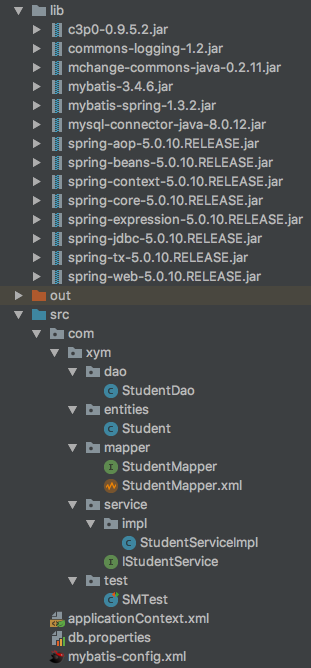
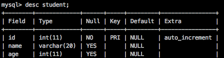

## 十二、Spring整合Mybatis
单独使用：conf.xml --> SqlSessionFactory
整合使用：需要通过Spring管理SqlSessionFactory,因此产生SqlSessionFactory所需的数据库信息不再放入conf.xml，而是放入Spring中

#### 1. 导入相关jar包

*目录结构及jar包*

#### 2. 创建实体类和表

*Student.java*
```java
public class Student {
    private int id;
    private String name;
    private int age;
    //get set toString
}
```
*表结构*

#### 3. 编辑Mybatis配置文件mybatis-config.xml

```xml
<?xml version="1.0" encoding="UTF-8" ?>
<!DOCTYPE configuration
        PUBLIC "-//mybatis.org//DTD Config 3.0//EN"
        "http://mybatis.org/dtd/mybatis-3-config.dtd">
<configuration>
    <mappers>
        <mapper resource="com/xym/mapper/StudentMapper.xml"/>
    </mappers>
</configuration>
```
#### 4. 通过mapper.xml将类和表建立映射关系

*StudentMapper.xml*
```xml
<?xml version="1.0" encoding="UTF-8" ?>
<!DOCTYPE mapper
        PUBLIC "-//mybatis.org//DTD Mapper 3.0//EN"
        "http://mybatis.org/dtd/mybatis-3-mapper.dtd">
<mapper namespace="com.xym.mapper.StudentMapper">
    <select id="queryStudentById" parameterType="int" resultType="com.xym.entities.Student">
    select * from student where id = #{id}
    </select>
    <insert id="addStudent" parameterType="com.xym.entities.Student">
        insert into student(id,name,age) values(#{id},#{name},#{age})
    </insert>
</mapper>
```
*StudentMapper.java*
```java
public interface StudentMapper {
    Student queryStudentById(int id);

    void addStudent(Student student);
}
```
#### 5. 配置Spring配置文件applicationContext.xml

```xml
<!--加载数据库信息-->
    <context:property-placeholder location="classpath*:db.properties"/>

    <!--配置数据库信息(替代Mybatis的配置文件)-->
    <bean id="dataSource" class="com.mchange.v2.c3p0.ComboPooledDataSource">
        <property name="driverClass" value="${driver}"/>
        <property name="jdbcUrl" value="${url}"/>
        <property name="user" value="${username}"/>
        <property name="password" value="${password}"/>
    </bean>

    <!--在SpringIOC容器中创建Mybatis的核心类SqlSessionFactory-->
    <bean id="sqlSessionFactory" class="org.mybatis.spring.SqlSessionFactoryBean">
        <property name="dataSource" ref="dataSource"/>
        <!--加载Mybatis配置文件
        <property name="configLocation" value="classpath:mybatis-config.xml"/>-->
        <!--加载Mapper.xml路径-->
        <property name="mapperLocations" value="com/xym/mapper/*.xml"/>
    </bean>

    <bean id="studentService" class="com.xym.service.impl.StudentServiceImpl">
        <property name="studentMapper" ref="studentDao" />
    </bean>
    <!--第一种方式生成Mapper对象-->
    <bean id="studentDao" class="com.xym.dao.StudentDao">
        <!--将Spring配置的sqlSessionFactory对象交给DAO-->
        <property name="sqlSessionFactory" ref="sqlSessionFactory"/>
    </bean>
```
#### 6. 使用Sping-Mybatis整合产物开发程序

通过Spring产生Mybatis最终操作需要的动态Mapper对象(StudentMapper)
Spring产生动态Mapper对象有三种方法
1. DAO层实现类，继承SqlSessionDaoSupport类

*StudentDao.java*
```java
public class StudentDao extends SqlSessionDaoSupport implements StudentMapper {
    @Override
    public Student queryStudentById(int id) {
        SqlSession sqlSession = super.getSqlSession();
        StudentMapper studentMapper = sqlSession.getMapper(StudentMapper.class);
        return studentMapper.queryStudentById(id);
    }

    @Override
    public void addStudent(Student student) {
        SqlSession sqlSession = super.getSqlSession();
        StudentMapper studentMapper = sqlSession.getMapper(StudentMapper.class);
        studentMapper.addStudent(student);
    }
}
```
2. 省略掉第一种方式的实现类,直接使用Mybatis提供的实现类MapperFactoryBean，但每个Mapper都需要配置一次

*applicationContext.xml*
```xml
...
    <!--第二种方式生成Mapper对象-->
    <bean id="studentDao" class="org.mybatis.spring.mapper.MapperFactoryBean">
        <property name="mapperInterface" value="com.xym.mapper.StudentMapper"/>
        <property name="sqlSessionFactory" ref="sqlSessionFactory"/>
    </bean>
```
3. 批量配置

*applicationContext.xml*
```xml
...
    <!--批量产生的Mapper在SpringIOC中的ID值默认是接口名首字母小写(接口名首字母小写=id值)-->
    <bean id="studentService" class="com.xym.service.impl.StudentServiceImpl">
        <property name="studentMapper" ref="studentMapper" />
    </bean>
    <!--第三种方式生成Mapper对象(批量产生多个Mapper)-->
    <!--批量产生的Mapper在SpringIOC中的ID值默认是接口名首字母小写(接口名首字母小写=id值)-->
    <bean id="mappers" class="org.mybatis.spring.mapper.MapperScannerConfigurer">
        <property name="sqlSessionFactoryBeanName" value="sqlSessionFactory"/>
        <!--指定批量产生哪个包中的Mapper对象，多个包用逗号隔开-->
        <property name="basePackage" value="com.xym.mapper"/>
    </bean>
```